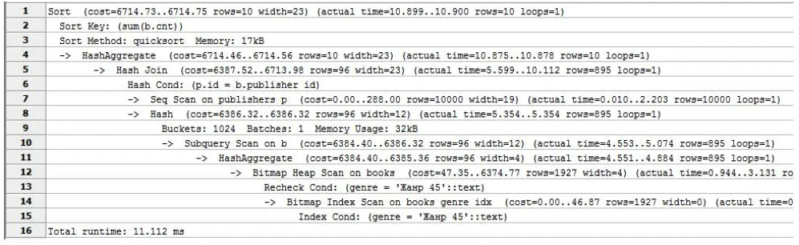

## 1.4 Постановка задачи статического анализа SQL-запросов в построении линии данных

Построение Data Lineage при разработке потока данных формирования отчётности
будет являться инструментом как документирования разрабатываемого решения, так и
инструментом оптимизации. Документирование линии данных позволит аналитикам в дальнейшем 
быстрее ориентироваться в отчёте, поскольку предоставляет целостную картину того, 
на основе каких данных формируется тот или иной показатель в сводной таблице. 
Также это позволит гибко находить точки интеграции с новыми источниками 
данных, чтобы наиболее эффективным способом выполнить обогащение отчётности
атрибутами из нового источника. Фактор оптимизации в построении линии данных 
заключается в том, что разработчик сможет проанализировать весь процесс
формирования данных как единый объект и за счёт анализа найти места для 
потенциальной оптимизации расчётов. Например, в процессе формирования отчётности
происходит обращение к одному и тому же рассчитываемому представлению несколько
раз. Для того, чтобы при каждом обращении к представлению не происходил
полный пересчёт данного объекта, разработчик может применить 
для данного представления материализацию. После выполнения данного шага 
оптимизации разработчик может выполнить процесс переформирования линии 
данных для отчёта и снова провести анализ его оптимизации,
итеративно подбираясь к наиболее оптимальной реализации с точки зрения
производительности и затрачиваемых ресурсов на выполнение.

Наиболее приближенным к программной реализации процесса формирования
отчётности является анализ скриптов на языке SQL (Structured Query Language),
которые применяются для формирования данных в реляционных базах данных, таких 
как PostgreSQL, MySQL, Oracle SQL, MSSQL Server и пр. Формируемый в результате 
выполнения скрипта план запроса формирует древовидную структуру того, как будет 
выполняться запрос движком базы данных. Помимо этого, план запроса будет
транслировать информацию о том, какие он будет использовать для этого 
внутренние алгоритмы и какова "стоимость" выполнения каждого шага (@fig:query-plan-example). 

<!-- ! Рисунок примера плана запроса -->
{#fig:query-plan-example}

Стоит отметить, что "стоимость" выполнения запроса – это абстрактная величина, которая зависит только
от физичеких параметров запроса и не предполагает оценку её логической
эффективности. То есть решения по доработке логики скрипта формирования отчётности 
остаётся за разработчиком и несёт оценочный характер. Помимо этого, план запроса 
базой данных формируется только на уровне глубины до ближайших материализованных объектов данных,
то есть цепочка формирований материализованных объектов уже не будет включена в план
запроса. Из этого следует, что более подходящим способом формирования линии данных
на основе скрипта на языке SQL является его статический анализ.

Как было упомянуто ранее, для применения статического анализа к конкретной задаче необходимо 
определить абстрактную модель представления, которая будет формироваться в результате анализа, 
сформировать алгоритм чтения исходного программного кода, из которого будут доставаться только 
необходимые для анализа структурные элементы, а также принципы сопоставления считанных 
элементов синтаксиса с атрибутами абстрактной модели представления. Поскольку основная задача
состоит в построении линии данных, она и будет является целевой моделью представления,
которую небходимо получить в результате анализа. Линия данных представляет из себя 
направленный ациклический граф, каждый узел которого представлен в виде атомарной
трансформации. Каждая из трансформаций имеет как входящие в неё узлы, которые будут
использоваться в трансформации, так и собственное конечное состояние с итоговым перечнем атрибутов.

Скриптовый язык SQL имеет формализованную структуру запроса к данным, он имеет конкретные смысловые элементы,
которые отвечают за свою часть по работе с данными (выборка данных, соединение или объединение,
фильтрация, сортировка и пр.). Это позволяет сформировать из этих элементов осмысленную сущность
с определённым набором атрибутов и свойств, при этом сущность будет формироваться 
единственным образом вне зависимости от диалекта конкретной СУБД, используемой для статического анализа.
Различия в синтаксисе будут влиять только на применяемые в запросах функции, которые в разных
диалектах могут иметь отличительные друг от друга названия, а также набор и порядок 
передаваемых аргументов, однако сама структура запроса никак не будет затронута.
Исправно работающий скрипт на языке SQL будет формировать не только набор 
моделей трансформаций, но и взаимосвязь между ними, поскольку при формировании
промежуточных результатов трансформаций будет использоваться уникальное название,
которое будет попадать в общее пространство имён. Таким образом, статический
анализ SQL полностью покрывает задачу как формирования узлов трансформаций, так и
последовательность их выполнения с учётом взаимосвящей между ними.

Свойства каждой трансформации данных в рамках SQL-скрипта можно интерпретировать
в набор числовых показателей. Эти показатели можно использовать для того, чтобы
позиционировать разные варианты реализаций относительно друг друга, тем самым
количественно определив, какая из реализаций одной и той же линии данных будет
эффективнее другой. На этапе оптимизации линии данных, набор числовых показателей 
поможет разработчику в поиске наиболее оптимальных методов улучшения выполнения
цепочки формирования данных, в конечном счёте приведя показатели абстрактной модели
представления в точку экстремума.

Подводя итог, статический анализ SQL-запросов позволит построить абстрактное представление
линии данных корпоративной отчётности. Это позволит автоматизировать документирование 
формируемых объектов данных, а также использовать линию данных в целях оптимизации расчётов.
Статический анализ скрипта на языке SQL является приоритетным способом анализа линии данных,
поскольку не завязан на конкретном диалекте или самой системе управления базами данных, не
имеет ограничений анализа, как физический план запроса. Поскольку SQL сам по себе является 
достаточно структурированным с точки зрения используемых конструкций, статический анализ
можно построить без акцента на конкретный диалект, опираясь только на основные элементы
запроса и общие правила языка. Также статический анализ даёт возможность формирования
числовых показателей абстрактной модели, что позволяет проводить сравнительную характеристику
между разными решениями. Однако для реализации абстрактной модели представления в виде 
линии формирования данных необходимо определить структуру модели, основные правила 
статического анализа, проводимым на скриптами на языке SQL, а также соответствие 
считанных структурных элементов запроса в атрибутные свойства спроектированной модели.